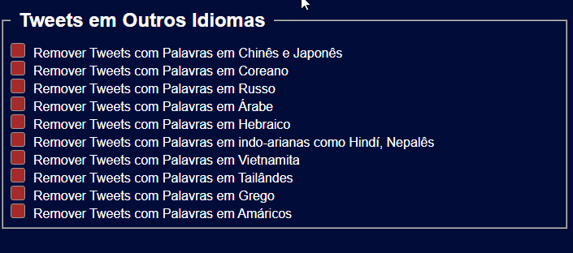
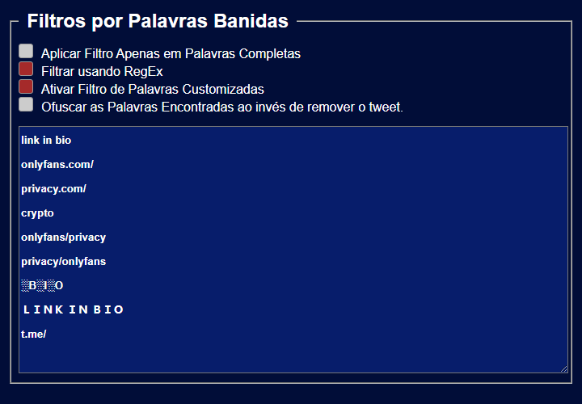
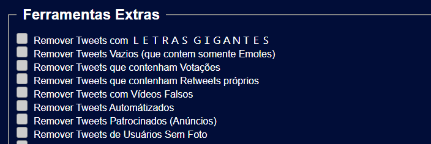
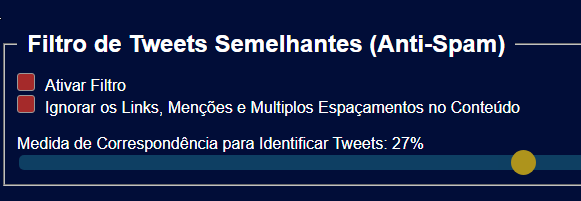
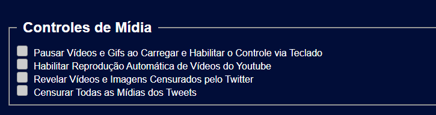

# Controle de Feed para o Twitter

Olá, esse é o GitHub da Extensão Controle de Feed para o Twitter, uma extensão que eu fiz para combater bots e coisas indesejadas no Twitter, além de ter várias melhorias visuais que podem ser aplicadas juntas ou não.

Esta extensão tem uma vasta quantidade de recursos pra personalizar visualmente o twitter, removendo coisas indesejadas como Anúncios, tweets baseados em padrões pre-definidos ou palavras definidas por você.

# Os Recursos da Extensão (Até a versão 1.13.1)

- ### Remover Tweets Baseados em Idiomas

Com essa extensão você pode remover Tweets que contenham caracteres em Outros Idiomas nos tweets, pode ser usada para filtrar e remover tweets em Outros Idiomas.
Os caracteres suportados até agora são:
- Amárico
- Japonês
- Chinês
- Russo
- Árabe
- Hebraico
- Coreano
- Indo-Arianas (como Hindí e Nepalês)
- Vietnamita
- Tailândes
- Grego
 Os tweets são escaneados usando padrões RegEx, como **'\\uAC00-\\uD7AF\\u1100-\\u11FF\\u3130-\\u318F'** e afetam todo o conteúdo do Tweet (oque pode e deve afetar pessoas com caracteres especiais nos Nomes)

- ### Remover Tweets baseado em Palavras pre-definidas por você
  Você também pode remover tweets que contenham palavras ou termos especificos definidos por você, usando da forma certa pode ser eficiente contra muitos tipos de BOTS e SPAMS. Esta função suporta o Uso de RegEx nas palavras para escanear usando Filtros super personalizados da sintaxe RegEx!
  Também suporta apenas ocultar a palavra encontrada ao invés de remover todo o tweet.

  

- ## Outros Filtros Genéricos
  A extensão também possúi outros filtros genéricos para remover tweets indesejados como
  - Tweets com LETRAS GRANDES
  - Tweets que contenham Votações
  - Tweets que contenham Links externos
  - Tweets que contenham Somente Emotes
  - Tweets automátizados
  - Retweets próprios
  - Tweets com imagem carregada de um site (Video Falso)
  - Anúncios (tweets patrocinados)
  - Tweets de Usuários sem Foto
    
  

  - ## Também, claro opções extras para melhorar a navegação
    A extensão também possúi algumas opções para melhorar a navegação
    - Previsão de Imagens
       - Habilita a previsão de imagens, passar o mouse por cima de imagens das postagens faz com que a imagem original seja carregada em um "popup" que segue o mouse. Você pode usar o Scroll do Mouse com a tecla Control para aplicar zoom ou remover o zoom das imagens e pode usar Control + S para abrir a imagem em uma nova guia!
     
    - Bloquear Usuários ao detectar nos filtros
       - Bloqueia automaticamente usuários que são detectados em filtros específicos
      Os filtros são: Lista de Palavras bloqueadas, Filtro de LETRAS GRANDES e Filtro de Tweets Automátizados

  
   - ## Filtro de Tweets semelhantes
     Procura e remove todos os tweets que sejam parecidos em questão de texto usando Similaridade de Jaccard
     Você pode habilitar a opção Ignorar Links, Menções e Espaçamentos para filtrar APENAS o texto puro dos tweets, aumentando a probabilidade de serem pegos pelo filtro e também pode configurar em porcentagem o quão parecidos os tweets devem ser para serem considerados iguais pela Extensão. 
    
  

   - ## Controles de Mídia
     Essa lista contém funcionalidades relacionados á Mídia e o Modo Streamer. Você pode evitar que vídeos sejam tocados automáticamente, ou até mesmo censurar todas as mídias de forma automática.

     - Pausar Vídeos e Gifs e habilitar controle via Teclado
       Habilita o controle nos vídeos pelo teclado (setas do nouse) e evita que os vídeos e gifs sejam reproduzidos automáticamente, tocando apenas ao passar o mouse por cima delas!

     - Habilitar Reprodução automática de Vídeos do Youtube
       Ativa o recurso de carregamento automático de vídeos do youtube, assim que aparecem na tela eles são carregados e reproduzidos (pode consumir muita CPU)

     - Revelar Mídia censurada pelo twitter
       Automaticamente remove a censura de imagens e vídeos do twitter.

     - Censurar Toda a Mídia (Modo Streamer)
       Censura todas as imagens e vídeos do twitter, a censura é removida ao passar o mouse por cima delas.
    
  
